Crafting performant scripts, Discord bots, game automations, and clean system logic.

  
  
  

<h2 align="center"> About Me</h2>

**Discord Bots** &middot; slash commands, moderation, ticket and utility systems

**FiveM** &middot; frameworks, game systems and automations

**Backend** &middot; advanced architecture and systems programming

Ask me about: `Python` &middot; `Lua` &middot; `FiveM` &middot; `Discord Bots` &middot; `Bot Automation`

Based in Turkey

<h2 align="center"> Live Status</h2>

  
  

   
  

<h2 align="center"> Tech Stack</h2>

<code>LANGUAGES</code>
 

 

<code>BACKEND &amp; DATA</code>
 

 

<code>WEB</code>
 

 

<code>TOOLS &amp; WORKFLOW</code>
 

<h3 align="center"> Frameworks &amp; Platforms</h3>

  
  
  
  

<h3 align="center"> AI Tools</h3>

  
  
  
  
  

    
  

<h2 align="center"> GitHub Stats</h2>

  
   
  

 

  

    
  

<h2 align="center"> Featured Projects</h2>

  

    
  

<h2 align="center"> Connect With Me</h2>

  
  

 

  

